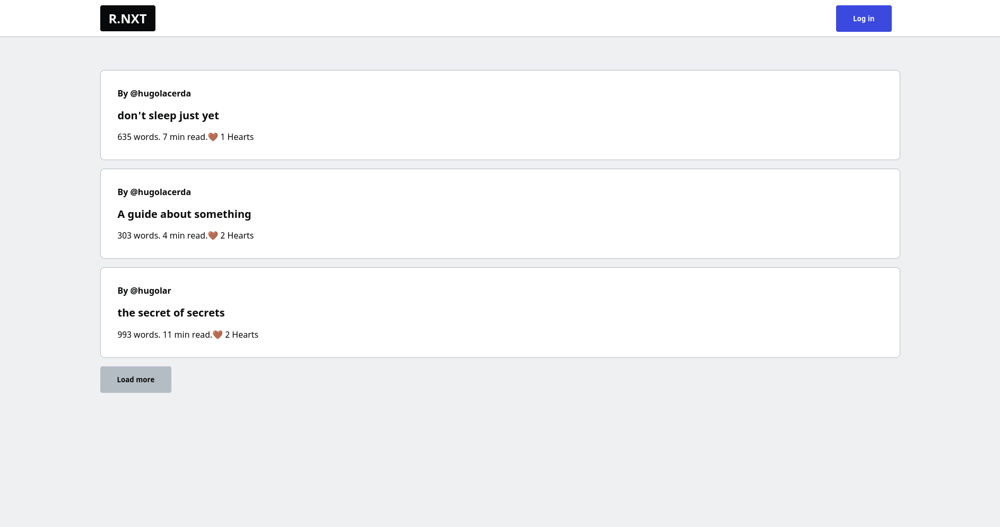
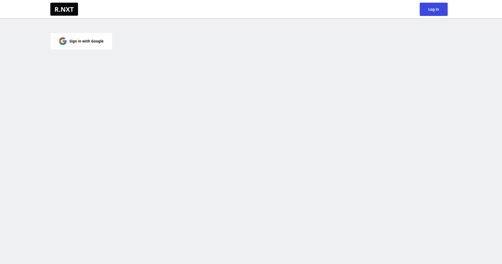
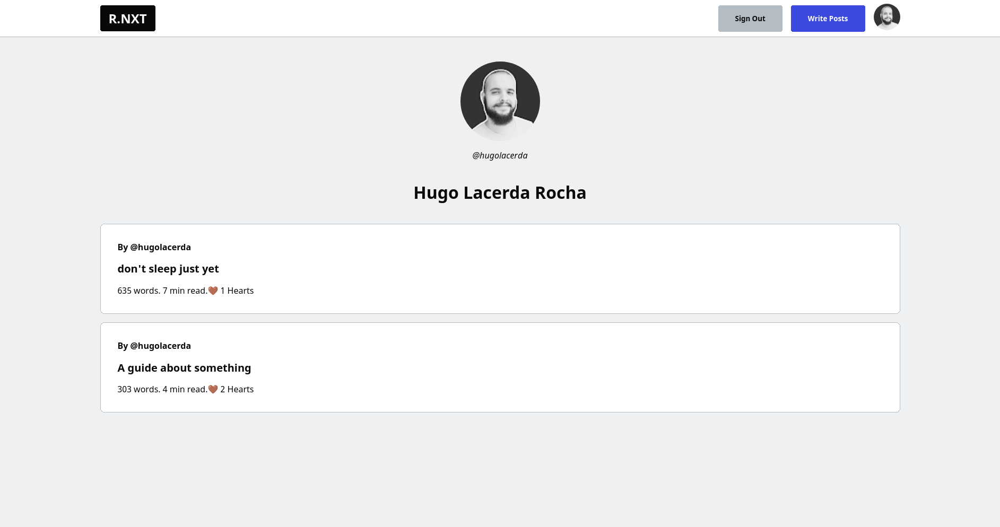
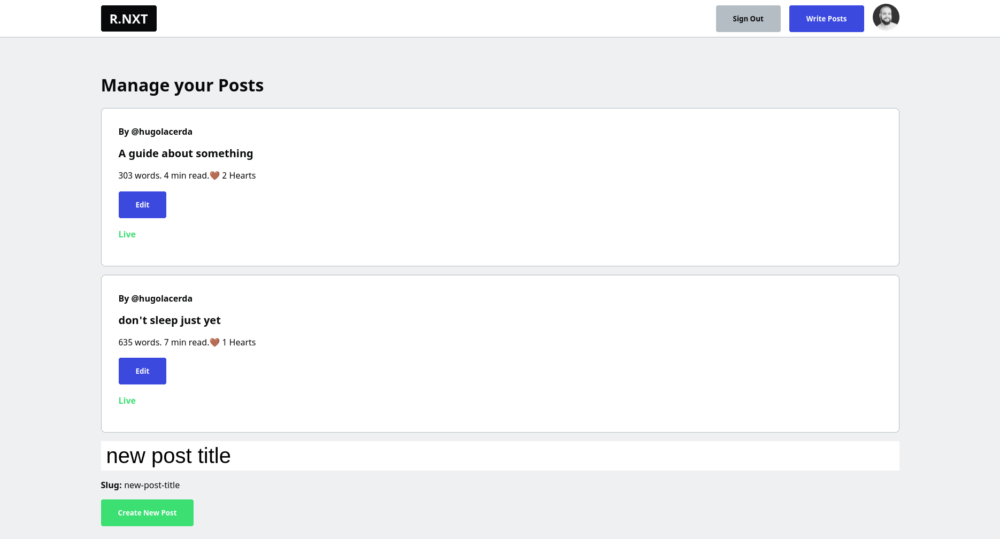
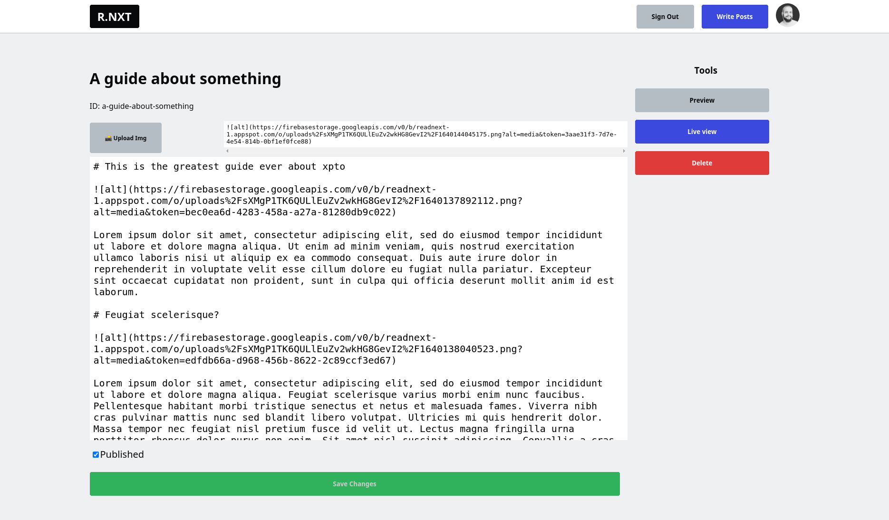
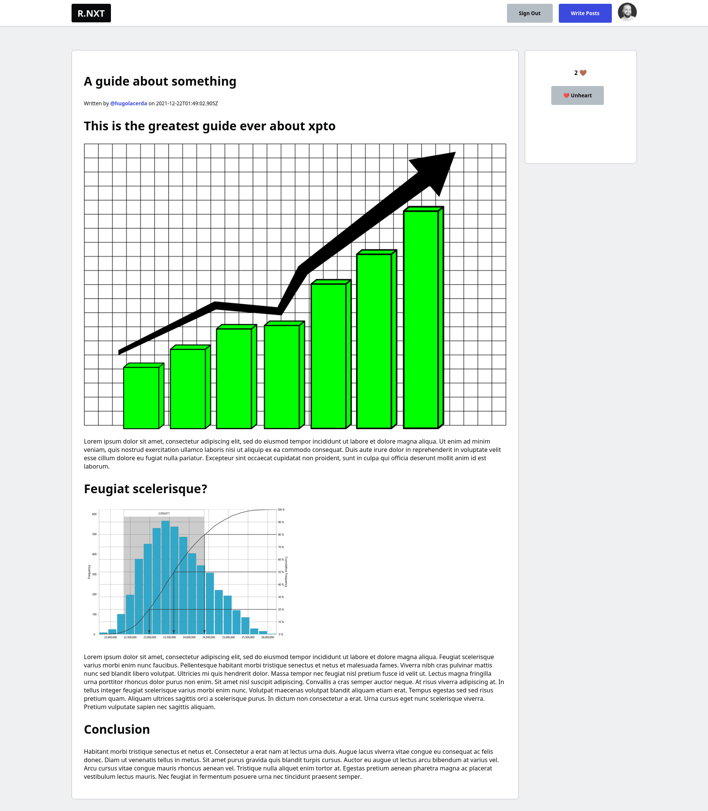

 
   

# READNEXT
<table>
<tr>
<td>
  A social blogging platform similar to DEV.to, where members can create content under their custom and unique username and publish it publicly, while readers can like posts in realtime.
</td>
</tr>
</table>

## Demo
The project demo is live at :  https://readnext-app.vercel.app/

## Site

### Feed
> /
> 

### Sign In/ Sign Up
> /enter

### Profile
> /username

### Admin
> /admin

### Edit
> /admin/post_slug

### Article 
> /username/post_slug
> 

## Features
- Users can sign in and sign up using their Google accounts
- Users can write and edit posts, being able to alter the content and the published status
- Users can preview their post while editing
- Users can delete their posts
- Users can like and unlike posts

## Future improvements

- [ ] Comments section
- [ ] Tags relation

## Built with 

- [Next.js](https://nextjs.org/)
- [Typescript](https://www.typescriptlang.org)
- [Firebase](https://firebase.google.com) 

